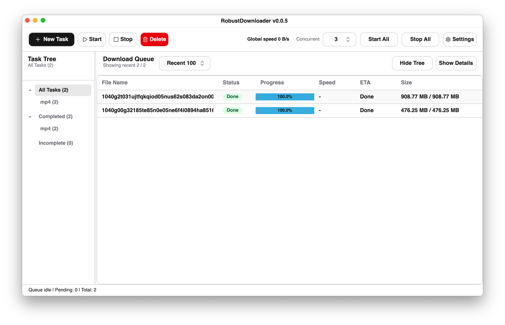

<div align="center">
  
  <h1>RobustDownloader</h1>
  <p><a href="README.md">中文</a></p>
</div>

RobustDownloader is a cross-platform desktop download manager built with .NET, Avalonia, and ShadUI. It focuses on resilient large-file downloads with queue management, resumable segmented downloading, site credentials, CRC64 workflows, and a clean operational UI.

## Screenshot

<picture>
  <source media="(prefers-color-scheme: dark)" srcset="screens/SS1_en_dark.png">
  <source media="(prefers-color-scheme: light)" srcset="screens/SS1_en.png">
  
</picture>

## Authorship

This project's code was implemented entirely by AI. Human input was limited to product direction, design preferences, requirements, and review feedback.

## Download

End users do not need to install the .NET SDK or a development environment. Download a prebuilt package for your platform from [Releases](https://github.com/nilaoda/RobustDownloader/releases), then extract or install it and run the app.

- Windows: download the Windows build archive, extract it, and run the app.
- macOS: download the macOS app package. If macOS reports that the app is from an unidentified developer or cannot be opened, first make sure you trust the downloaded file, then run `xattr -dr com.apple.quarantine RobustDownloader.app` before opening it.
- Linux: download a matching package if available, or build from source.

## Features

- Multi-task download queue with start, stop, delete, start-all, and stop-all actions
- Resumable segmented downloads with configurable thread count and block size
- Global concurrency control
- Persisted task list scope: recent 50, recent 100, recent 200, or all tasks
- Left-side task tree for filtering by all, completed, incomplete, and file extension
- Automatic fallback to single-thread mode when the server does not support range requests
- Batch task creation by pasting one URL per line
- Automatic Add Task URL filling from the clipboard when it contains one or more HTTP links
- Batch filename templates: `#` inserts a number and `*` inserts the auto-detected original filename
- Custom numbering start, step, and digit width for batch filename templates, with full preview and duplicate filename validation
- The task table automatically scrolls to the bottom after new tasks are added
- Custom HTTP headers per task and default headers in settings
- HTTP proxy settings: system proxy, no proxy, or manual proxy URL
- Site credential rules for Basic Auth
- Optional CRC64 extraction or skipping
- Optional file timestamp update from the server response
- Local task and settings persistence as JSON
- Dynamic language switching: Auto, English, Simplified Chinese, Traditional Chinese
- Theme selection: system, light, dark
- Close-to-tray support, or close to the macOS menu bar, with an exit menu item
- Single-instance behavior that activates the existing window when launched again
- Collapsible task detail panel with logs, headers, diagnostics, and run mode
- Custom background image with blur, opacity, and stretch mode controls
- Automatic update check on startup and periodic GitHub release check
- Window title includes the application version from the project metadata

## Build From Source

This section is only for developers or users who want to run or package the app from source.

```bash
dotnet restore src/RobustDownloader.sln
dotnet run --project src/RobustDownloader/RobustDownloader.csproj
```

To build only:

```bash
dotnet build src/RobustDownloader.sln
```

Building from source requires a .NET SDK compatible with the project target framework and a macOS, Windows, or Linux desktop environment supported by Avalonia.

## Settings

Open **Settings** from the main toolbar to configure:

- Appearance: language, theme, and custom background image (blur, opacity, stretch)
- Window behavior: close to tray/menu bar or exit directly, plus close confirmation
- Auto update check: startup and periodic checks
- Download defaults: thread count, block size, concurrency, CRC64 behavior, timestamp behavior
- Network: HTTP proxy mode and manual proxy URL
- Save and headers: default save directory and default HTTP headers
- Credentials: site matching rules with username and password
- Data files: paths for task list JSON and settings JSON

## Download Model

RobustDownloader first probes the server with an HTTP `Range` request. When the server supports partial content, the file is split into configurable blocks and multiple workers download those blocks in parallel. The app keeps a `.downloading` file plus a small `.cfg` resume marker, so a stopped task can continue from the last safely written offset when the server still provides compatible range semantics.

Downloaded blocks are not written to disk immediately in arbitrary order. They are buffered in memory and a single writer commits them to the target file in offset order. This design intentionally trades higher memory usage for more predictable disk I/O and safer resume behavior.

Why memory usage can look high:

- Each active task may hold multiple completed or in-flight blocks in memory.
- The upper bound is mainly affected by block size, thread count, and task concurrency.
- Larger blocks reduce coordination overhead and can improve throughput, but they also increase the buffer footprint.
- Reducing block size, thread count, or global concurrency lowers memory usage.

Why it is friendlier to mechanical hard drives:

- Parallel network workers can finish blocks out of order, but disk writes are serialized in file order.
- Sequential writes reduce seek-heavy random I/O, which is especially important for HDDs.
- The app preallocates the `.downloading` file when the total size is known, reducing repeated file growth during download.
- Flushes are batched instead of forcing a disk sync for every small network read.

If the server does not support `Range`, RobustDownloader falls back to a single sequential stream. That mode is simple and compatible, but it cannot provide the same reliable segmented resume behavior.

## Project Structure

- `src/RobustDownloader.sln`: solution file
- `src/RobustDownloader/`: application source code, assets, and project file
- `README.md`, `README.en.md`, `LICENSE`: project documentation and license

## Data Files

RobustDownloader stores task and settings data under the user application data directory:

- `tasks.json`: saved task list
- `settings.json`: app settings

The exact paths are shown in **Settings > Data Files**.

## Notes

RobustDownloader keeps temporary download state where needed so stopped tasks can resume safely when possible. Server behavior still matters: some hosts do not support range requests or reliable resume semantics.

## License

MIT License. See [LICENSE](LICENSE).
