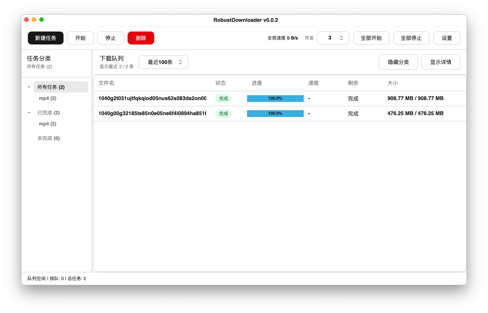

<div align="center">
  
  <h1>RobustDownloader</h1>
  <p><a href="README.en.md">English</a></p>
</div>

RobustDownloader 是一个基于 .NET、Avalonia 和 ShadUI 的跨平台桌面下载管理器。它重点面向大文件下载场景，提供队列管理、可续传分段下载、站点凭据、CRC64 工作流，以及清晰的工具型界面。

## 界面预览

<picture>
  <source media="(prefers-color-scheme: dark)" srcset="screens/SS1_dark.png">
  <source media="(prefers-color-scheme: light)" srcset="screens/SS1.png">
  
</picture>

## 作者声明

本项目代码完全由 AI 实现。人工仅提供产品方向、设计思路、需求描述和评审反馈。

## 下载和运行

普通用户不需要安装 .NET SDK 或开发环境。请直接在 [Releases](https://github.com/nilaoda/RobustDownloader/releases) 下载对应平台的编译包，解压或安装后运行即可。

- Windows：下载 Windows 构建压缩包，解压后运行程序。
- macOS：下载 macOS 应用包。若系统提示应用来自未识别开发者或无法打开，请先确认下载来源可信，再执行 `xattr -dr com.apple.quarantine RobustDownloader.app` 移除隔离属性后打开。
- Linux：下载对应发行包或自行从源码构建。

## 功能

- 多任务下载队列，支持开始、停止、删除、全部开始和全部停止
- 可续传的分段下载，支持配置线程数和分块大小
- 全局并发控制
- 支持持久化任务列表范围：最近 50 条、最近 100 条、最近 200 条或全部任务
- 支持左侧任务树，按全部、已完成、未完成以及文件扩展名快速过滤任务
- 当服务器不支持 Range 请求时，自动切换为单线程顺序下载
- 支持粘贴多行 URL 批量创建任务
- 新建任务窗口可从剪贴板自动读取单个或多个 HTTP 链接
- 批量任务支持自定义文件名模板：`#` 表示编号，`*` 表示自动识别出的原始文件名
- 批量文件名模板支持自定义编号起始值、步长和位数，并提供完整预览和重复文件名校验
- 新增任务后任务表格会自动滚动到底部
- 支持任务级自定义 HTTP Header，以及全局默认 Header
- 支持 HTTP 代理设置：跟随系统、不使用代理或手动填写代理地址
- 支持站点匹配规则和 Basic Auth 用户名/密码
- 支持仅提取 CRC64 或跳过 CRC64 提取
- 支持使用服务器时间更新文件时间
- 使用本地 JSON 持久化任务和设置
- 支持动态语言切换：自动、英文、简体中文、繁体中文
- 支持主题设置：跟随系统、浅色、深色
- 支持关闭到系统托盘或 macOS 菜单栏，并提供退出菜单
- 支持单实例运行，重复启动会激活已有窗口
- 支持命令行添加任务、静默添加、开始全部和停止全部
- 支持 Windows 任务栏和 macOS Dock 整体下载进度指示，并可在设置中关闭
- 支持可折叠的任务详情面板，展示日志、Header、诊断和运行模式
- 支持自定义背景图片，可调整模糊、透明度和拉伸方式
- 支持自动检查更新，启动时和运行期间定期检查 GitHub 最新版本
- 标题栏展示来自项目元数据的应用版本号

## 从源码构建

以下内容仅面向开发者，或需要自行从源码运行/打包的用户。

```bash
dotnet restore src/RobustDownloader.sln
dotnet run --project src/RobustDownloader/RobustDownloader.csproj
```

仅构建：

```bash
dotnet build src/RobustDownloader.sln
```

源码构建需要安装与项目目标框架兼容的 .NET SDK，并使用 macOS、Windows 或 Linux 桌面环境。

## 命令行控制

RobustDownloader 支持从命令行向已运行的主实例发送任务命令。任务状态仍由主实例统一管理，避免多个进程同时修改任务数据。
命令行帮助和错误信息会复用应用语言设置；设置为自动时会按系统语言识别。

```bash
RobustDownloader --help
RobustDownloader --add "https://example.com/file.zip"
RobustDownloader --add "https://example.com/file.zip" --silent
RobustDownloader --add "https://example.com/file.zip" --start --threads 8 --block-size 32
RobustDownloader --add "https://example.com/file.zip" --dir "<save-dir>" --name "file.zip"
RobustDownloader --start-all --silent
RobustDownloader --stop-all --silent
```

常用选项：

- `--add <url> [<url> ...]`：添加一个或多个下载任务
- `--dir <path>`：指定保存目录
- `--name <filename>`：为单个 URL 指定文件名
- `--threads <number>`：指定新任务线程数
- `--block-size <mb>`：指定新任务分块大小
- `--header <name:value>`：添加任务级 Header，可重复使用
- `--start`：添加后立即进入下载队列
- `--queue`：只添加任务，不自动开始下载（默认行为）
- `--silent`：执行命令时不激活主窗口
- `--show`：显示主窗口
- `--start-all` / `--stop-all`：开始或停止全部任务

## 设置项

在主工具栏打开 **设置**，可以配置：

- 外观：语言、主题和自定义背景图（支持模糊、透明度和拉伸方式）
- 窗口行为：关闭到托盘/菜单栏或直接退出，以及是否每次关闭时确认
- 自动检查更新：启动时和运行期间定期检查
- 下载参数：默认线程数、分块大小、并发、CRC64 行为、文件时间行为
- 网络：HTTP 代理模式和手动代理地址
- 保存与 Header：默认保存目录和默认 HTTP Header
- 站点凭据：站点匹配规则、用户名和密码
- 数据文件：任务列表 JSON 和设置项 JSON 的路径

## 下载原理

RobustDownloader 会先使用 HTTP `Range` 请求探测服务器能力。服务器支持分段响应时，软件会把目标文件拆成可配置大小的分块，并由多个下载 worker 并行拉取这些分块。任务运行时会保留 `.downloading` 临时文件和一个很小的 `.cfg` 续传标记，因此停止任务后，只要服务器仍然提供兼容的 Range 语义，就可以从最后一次安全写入的位置继续下载。

已下载的分块不会直接按完成顺序随机写入磁盘，而是先进入内存缓冲区，再由单独的写入流程按照文件偏移顺序写入目标文件。这个设计是有意用更高一些的内存占用换取更可预测的磁盘 I/O 和更稳妥的续传行为。

为什么内存占用可能看起来偏高：

- 每个正在运行的任务可能同时持有多个已完成或正在处理的分块。
- 内存上限主要受分块大小、线程数和全局并发数影响。
- 较大的分块可以减少调度开销，并可能提升吞吐，但也会增加缓冲区占用。
- 如果希望降低内存占用，可以调小分块大小、线程数或全局并发数。

为什么对机械硬盘更友好：

- 网络下载 worker 可以乱序完成分块，但磁盘写入会按文件顺序串行提交。
- 顺序写入可以减少机械硬盘上代价较高的随机寻道。
- 当已知文件总大小时，软件会预先分配 `.downloading` 文件，减少下载过程中的反复扩容。
- 写盘 flush 会批量进行，而不是每次小块网络读取后都强制同步磁盘。

如果服务器不支持 `Range`，RobustDownloader 会自动退回单线程顺序流式下载。这个模式兼容性更好，但无法提供同等可靠的分段续传能力。

## 项目结构

- `src/RobustDownloader.sln`：解决方案文件
- `src/RobustDownloader/`：应用源码、资源文件和项目文件
- `README.md`、`README.en.md`、`LICENSE`：项目文档和许可证

## 数据文件

RobustDownloader 会把任务和设置保存到用户应用数据目录：

- `tasks.json`：任务列表
- `settings.json`：应用设置

具体路径可以在 **设置 > 数据文件** 中查看。

## 说明

RobustDownloader 会在需要时保留下载临时状态，以便停止后的任务尽可能安全续传。实际可续传能力仍取决于服务器行为：部分站点不支持 Range 请求，或不提供可靠的续传语义。

## 许可证

MIT License。详见 [LICENSE](LICENSE)。
